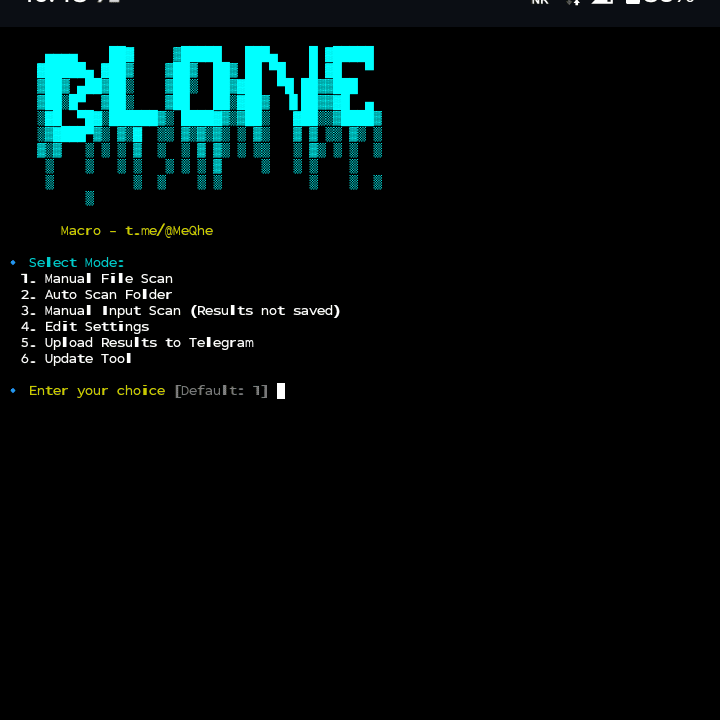

<h1 align="center">
  <a href="https://t.me/mscanfocus">
    <div align="center">
      
    </div>
    <span>
      mscanfocus
    </span>
  </a>
</h1>



`mscanfocus` is a powerful and intuitive network scanner designed for Termux environments. It allows you to efficiently scan hosts, manage settings, and automate result sharing, helping you stay organized and productive directly from your mobile device.

## Features

- **Multiple Scan Modes**:
  - **Manual File Scan**: Scan hosts from a specified `.txt` file.
  - **Auto Scan Folder**: Automatically process all `.txt` files in a designated folder.
  - **Manual Input Scan**: Quickly scan hosts entered directly via the command line.
- **Configurable Scan Parameters**: Customize ports, threads, and HTTP methods (GET, POST, HEAD, etc.).
- **Intelligent 302 Redirect Handling**: Configure exclusion lists for 302 redirects to filter out unwanted results.
- **Integrated Telegram Upload**: Upload scan results to a Telegram chat or channel with custom captions including scan details.
- **Automatic Updates**: Keep your tool up-to-date directly from your Git repository, preserving your settings and uploaded results.
- **Persistent Settings**: All your configurations are saved and loaded automatically.

## Launch

Follow these steps to set up and run `mscanfocus` using this repository:

1.  **Clone Repository**

    ```bash
    git clone https://github.com/mwmQi/mscanfocus.git
    ```

2.  **Navigate to Project Directory**

    ```bash
    cd mscanfocus
    ```

3.  **Install and Setup**

    Run the `install.sh` script to set up the tool and make it executable. This will copy the `mscanfocus` script to your Termux `bin` directory.

    ```bash
    chmod +x install.sh
    ./install.sh
    ```

    **Congrats!** `mscanfocus` is now installed and ready to use.

## Usage

Simply run `mscanfocus` from your Termux terminal:

```bash
mscanfocus
```

This will launch the interactive menu where you can choose your desired scan mode or manage settings.

## Settings

`mscanfocus` uses a `settings.txt` file to store its configuration. You can edit these settings directly from the tool's menu (Option 4).

| Variable              | Type    | Description                                                              |
| :-------------------- | :------ | :----------------------------------------------------------------------- |
| `default_ports`       | String  | Comma-separated default ports to scan (e.g., `443,80`).                  |
| `default_threads`     | Number  | Default number of threads to use for scanning.                           |
| `default_method`      | String  | Default HTTP method (e.g., `GET`, `POST`, `HEAD`).                       |
| `timeout`             | Number  | Request timeout in seconds.                                              |
| `chunk_size`          | Number  | Number of lines to read at once from host files.                         |
| `allow_redirects`     | Boolean | Whether to follow redirects during requests (`true` or `false`).         |
| `telegram_bot_token`  | String  | Your Telegram Bot API token obtained from `@BotFather`.                  |
| `telegram_chat_id`    | String  | Your Telegram Chat ID (e.g., `@mychannel` or `-123456789`).              |
| `exclude_redirect_urls` | String  | Comma-separated URLs to exclude for 302 redirects (e.g., `example.com`). |
| `git_repo_url`        | String  | URL of your Git repository for updates (e.g., `https://github.com/mwmQi/mscanfocus.git`). |